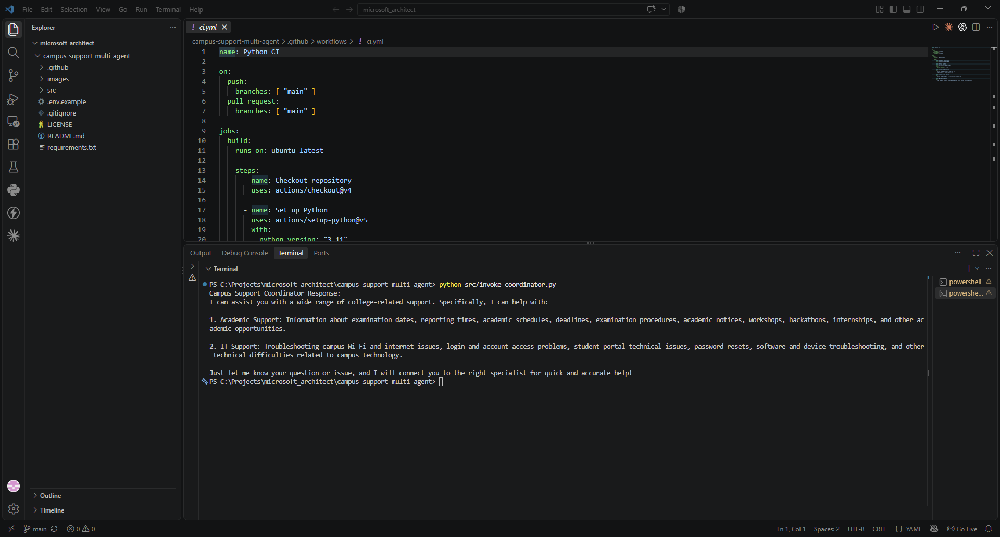
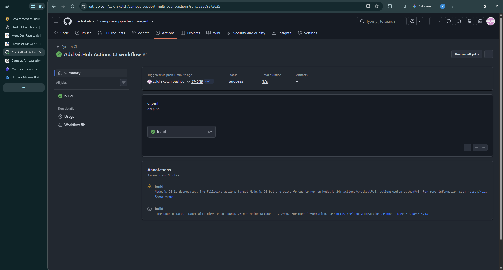

# Campus Support Multi-Agent System

[](https://github.com/zaid-sketch/campus-support-multi-agent/actions/workflows/ci.yml)

A multi-agent AI system built using Microsoft Foundry to provide students with academic and IT support through intelligent agent-to-agent routing.

---

## Overview

The Campus Support Multi-Agent System uses a coordinator agent to understand a student's request and route it to the appropriate specialist agent.

The system consists of three agents:

- **Campus Support Coordinator** – analyzes student requests and delegates them to the appropriate specialist agent.
- **Academic Support Agent** – handles examination schedules, reporting times, academic deadlines, notices, workshops, hackathons, internships, and other academic queries.
- **IT Support Agent** – handles campus Wi-Fi, login issues, account access, password problems, student portal issues, and basic technical troubleshooting.

---

## Architecture

The system follows a coordinator-based multi-agent architecture:

```text
Student
   ↓
Campus Support Coordinator
   ↓
Request Classification
   ↓
┌─────────────────────────┐
│                         │
↓                         ↓
Academic Support Agent    IT Support Agent
│                         │
└─────────────┬───────────┘
              ↓
      Response to Student
```

The Campus Support Coordinator uses agent-to-agent communication to delegate requests to the appropriate specialist agent.

---

## Key Features

- Multi-agent architecture
- Intelligent request classification and routing
- Agent-to-Agent (A2A) communication
- Dedicated academic support agent
- Dedicated IT support agent
- Knowledge-grounded responses
- Microsoft Foundry agent deployment
- Synthetic evaluation dataset
- Automated agent evaluation
- Application Insights tracing and monitoring
- Python-based agent invocation
- Environment configuration example
- Secure credential handling
- GitHub Actions continuous integration

---

## Example Workflow

### Student Request

> My laptop cannot connect to the campus Wi-Fi. Can you help me troubleshoot it?

### Routing

```text
Student Request
      ↓
Campus Support Coordinator
      ↓
Request identified as IT Support
      ↓
IT Support Agent
      ↓
Troubleshooting Response
      ↓
Student
```

This demonstrates how the coordinator delegates a technical request to the IT Support Agent.

---

## Evaluation

The Campus Support Coordinator was evaluated in Microsoft Foundry using an automatic evaluation run with multiple test queries covering academic and IT-support scenarios.

Evaluation criteria included:

- Task Adherence
- Relevance
- Intent Resolution
- Groundedness
- Coherence
- Fluency
- Tool Output Utilization
- Tool-call metrics

### Evaluation Results

| Metric | Result |
|---|---:|
| Task Adherence | 100% |
| Relevance | 100% |
| Intent Resolution | 100% |
| Tool Output Utilization | 94% |

The evaluation demonstrated strong performance across the primary response-quality metrics.


---

## Monitoring and Tracing

Azure Application Insights is integrated with the Microsoft Foundry project to capture agent execution traces.

Tracing was used to inspect agent execution and verify that the Campus Support Coordinator delegates requests to specialist agents.

### Agent-to-Agent Routing

The following trace demonstrates the Campus Support Coordinator routing a technical support request to the IT Support Agent using Agent-to-Agent (A2A) communication.


### Knowledge Retrieval

The system uses the configured knowledge source to retrieve relevant information when handling student queries.

The following trace provides evidence of the knowledge retrieval process during agent execution.


### Local Coordinator Execution

The Campus Support Coordinator was successfully invoked locally using the Python client connected to the deployed Microsoft Foundry agent.

The execution confirms that the local application can authenticate with Azure, connect to the Microsoft Foundry project, and invoke the deployed Campus Support Coordinator.



### GitHub Actions CI

A GitHub Actions workflow is configured to automatically validate the Python project on pushes and pull requests to the `main` branch.

The workflow installs the project dependencies and performs the configured validation checks. The successful workflow run confirms that the CI pipeline is working correctly.




## Technologies Used

- Microsoft Foundry
- Azure AI
- GPT-4.1-mini
- Python
- Multi-Agent Architecture
- Agent-to-Agent (A2A) Communication
- Azure Application Insights
- Azure Monitor
- GitHub
- GitHub Actions

---

## Deployment

The Campus Support Coordinator is deployed and running in Microsoft Foundry.

| Property | Value |
|---|---|
| Agent | `campus-support-coordinator` |
| Platform | Microsoft Foundry |
| Agent Version | `4` |
| Status | Running |

The deployed agent can be invoked programmatically using the Python script provided in:

```text
src/invoke_coordinator.py
```

The specialist Academic Support Agent and IT Support Agent are connected to the coordinator for request delegation.

---

## Installation and Usage

### Prerequisites

Before running the project, make sure you have:

- Python 3.11 or later
- An Azure account with access to the Microsoft Foundry project
- Azure CLI installed
- Access to the deployed Campus Support Coordinator agent
- Required Azure permissions for authentication

### Clone the Repository

```bash
git clone https://github.com/zaid-sketch/campus-support-multi-agent.git
cd campus-support-multi-agent
```

### Install Dependencies

```bash
pip install -r requirements.txt
```

### Azure Authentication

Sign in to Azure using the Azure CLI:

```bash
az login
```

The Python invocation script uses `DefaultAzureCredential` to authenticate securely with Azure.

No API keys or credentials are hard-coded in the source code.

### Environment Configuration

The repository includes:

```text
.env.example
```

This file provides a reference for environment configuration.

Do not commit:

- API keys
- Access tokens
- Passwords
- `.env` files
- Azure credentials
- Other secrets

The `.gitignore` file is configured to prevent common secret and Python-generated files from being committed.

### Run the Coordinator

After authenticating with Azure, run:

```bash
python src/invoke_coordinator.py
```

The script connects to the Microsoft Foundry project and invokes the deployed `campus-support-coordinator` agent.

---

## Continuous Integration

This repository uses GitHub Actions for continuous integration.

The CI workflow automatically runs when changes are pushed to the repository.

The workflow:

1. Checks out the repository
2. Sets up the Python environment
3. Installs project dependencies
4. Validates the Python source code
5. Confirms that the build completes successfully

The workflow configuration is located at:

```text
.github/workflows/ci.yml
```

The latest CI workflow has completed successfully.

The CI status can also be viewed using the badge at the top of this README.

---

## Repository Structure

```text
campus-support-multi-agent/
│
├── .github/
│   └── workflows/
│       └── ci.yml
│
├── images/
│   ├── evaluation-results.png
│   ├── it-agent-routing-trace.png
│   └── knowledge-search-trace.png
│
├── src/
│   └── invoke_coordinator.py
│
├── .env.example
├── .gitignore
├── LICENSE
├── README.md
└── requirements.txt
```

---

## Security

This repository does not contain real API keys, access tokens, passwords, or other authentication secrets.

Authentication is handled using Azure identity mechanisms through `DefaultAzureCredential`.

Sensitive environment files are excluded through `.gitignore`, while `.env.example` is provided only as a configuration reference.

---

## Project Status

The Campus Support Multi-Agent System has been successfully built, deployed, tested, evaluated, and monitored in Microsoft Foundry.

The repository includes:

- Multi-agent architecture implementation
- Deployed Campus Support Coordinator
- Academic Support Agent integration
- IT Support Agent integration
- Agent-to-Agent routing evidence
- Knowledge retrieval evidence
- Microsoft Foundry evaluation results
- Azure Application Insights tracing
- Python invocation code
- Dependency configuration
- Environment configuration example
- Secure secret handling
- GitHub Actions CI workflow
- Passing CI build

---

## Validation Checklist

- [x] Multi-agent architecture implemented
- [x] Campus Support Coordinator created
- [x] Academic Support Agent connected
- [x] IT Support Agent connected
- [x] Agent-to-Agent (A2A) routing tested
- [x] Knowledge retrieval tested
- [x] Automatic evaluation completed
- [x] Task Adherence: 100%
- [x] Relevance: 100%
- [x] Intent Resolution: 100%
- [x] Tool Output Utilization: 94%
- [x] Microsoft Foundry traces captured
- [x] Agent deployed and running
- [x] Python invocation code included
- [x] Dependencies documented
- [x] Environment configuration example provided
- [x] Secrets excluded from repository
- [x] GitHub Actions CI configured
- [x] CI build passed
- [x] Local coordinator invocation tested successfully
- [x] GitHub Actions CI workflow passed successfully

---

## Author

**Zaid Khan**  
B.Tech Computer Science & Engineering  
Hindustan College of Science & Technology

---

## License

This project is licensed under the terms provided in the `LICENSE` file.
