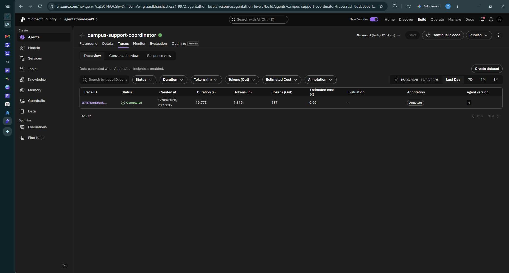
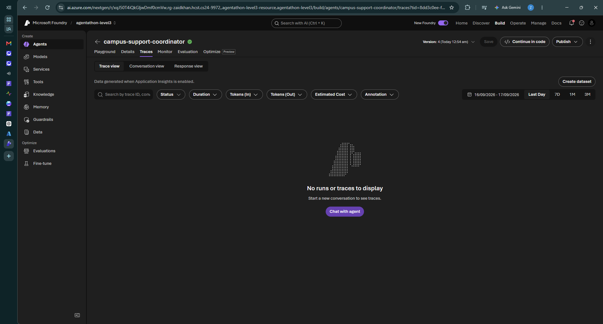
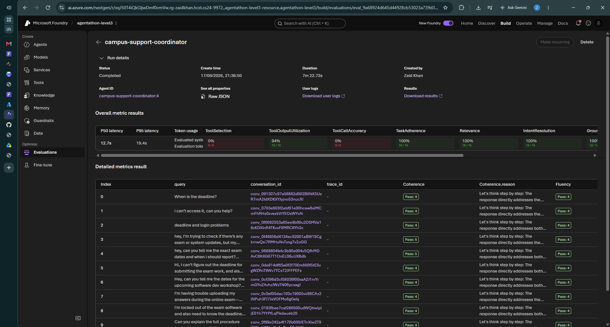

# Campus Support Multi-Agent System

A multi-agent AI system built using Microsoft Foundry to provide students with academic and IT support through intelligent agent-to-agent routing.

## Overview

The Campus Support Multi-Agent System uses a coordinator agent to understand a student's request and route it to the appropriate specialist agent.

The system consists of three agents:

- **Campus Support Coordinator** – analyzes requests and delegates them to the appropriate specialist.
- **Academic Support Agent** – handles examination schedules, reporting times, academic deadlines, notices, workshops, hackathons, internships, and other academic queries.
- **IT Support Agent** – handles campus Wi-Fi, login issues, account access, password problems, student portal issues, and basic technical troubleshooting.

## Architecture

Student
↓
Campus Support Coordinator
↓
Request Classification
↓
Academic Support Agent / IT Support Agent
↓
Response returned to the student

The coordinator uses agent-to-agent communication to delegate requests to specialist agents.

## Key Features

- Multi-agent architecture
- Intelligent request routing
- Agent-to-agent communication
- Academic support
- IT troubleshooting support
- Knowledge-grounded responses
- Synthetic evaluation dataset
- Automated agent evaluation
- Application Insights tracing and monitoring

## Evaluation

The system was evaluated in Microsoft Foundry using a synthetic evaluation dataset.

Evaluation criteria included:

- Task Adherence
- Relevance
- Intent Resolution
- Groundedness
- Coherence
- Fluency
- Tool utilization and tool-call metrics

The evaluation demonstrated strong performance across the primary response-quality metrics.

## Monitoring and Tracing

Application Insights is integrated with the project to capture agent execution traces.

Tracing was used to verify that the coordinator correctly delegates requests to specialist agents, including routing IT-related requests to the IT Support Agent.

## Example

**Student request:**

> My laptop cannot connect to the campus Wi-Fi. Can you help me troubleshoot it?

**Routing:**

Campus Support Coordinator → IT Support Agent → Student Response

## Technologies Used

- Microsoft Foundry
- Azure AI
- GPT-4.1-mini
- Multi-Agent Architecture
- Agent-to-Agent (A2A) Communication
- Azure Application Insights
- Azure Monitor
- GitHub

## Project Status

The multi-agent system has been built, tested, evaluated, and monitored successfully.

## Author

**Zaid Khan**  
B.Tech Computer Science & Engineering  
Hindustan College of Science & Technology

## Agent Execution Evidence

### Agent-to-Agent Routing

The Campus Support Coordinator routes technical support requests to the IT Support Agent using agent-to-agent (A2A) communication.

### Knowledge Retrieval

The system uses the configured knowledge source to retrieve relevant information when handling student queries.

### Evaluation Results

The Campus Support Coordinator was evaluated in Microsoft Foundry using an automatic evaluation run.

The evaluation assessed response quality and agent behavior across multiple test queries, including academic and IT-support scenarios.

Key results included:
- Task Adherence: 100%
- Relevance: 100%
- Intent Resolution: 100%
- Tool Output Utilization: 94%

